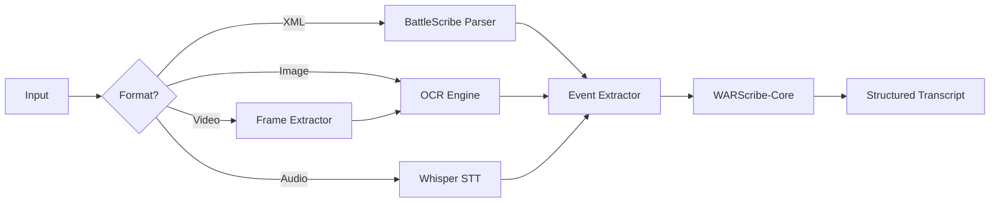

# WARScribe-Parser Architecture

> Agent context artifact for the multimodal ingestion engine.

## Purpose

Multimodal ingestion engine extracting game transcripts from photos, videos, audio, and documents to build structured battle reports.

## Technology Stack

- **Language**: Python 3.11+
- **OCR**: Tesseract / Cloud Vision
- **Audio**: Whisper (OpenAI)
- **ML**: PyTorch for custom models

## Directory Structure

```
├── src/warscribe_parser/
│   ├── ingestors/      # Format-specific handlers
│   │   ├── battlescribe.py  # XML roster import
│   │   ├── image.py         # OCR extraction
│   │   ├── audio.py         # Speech-to-text
│   │   └── video.py         # Frame extraction
│   ├── extractors/     # NLP event extraction
│   ├── models/         # ML models
│   └── pipeline/       # Processing orchestration
├── tests/
└── models/             # Trained model weights
```

## Processing Pipeline



## Integration Points

| Input      | Handler      | Output    |
| ---------- | ------------ | --------- |
| .ros/.rosz | BattleScribe | Army list |
| .jpg/.png  | OCR          | Raw text  |
| .mp3/.wav  | Whisper      | Raw text  |
| .mp4       | Frame + OCR  | Raw text  |
